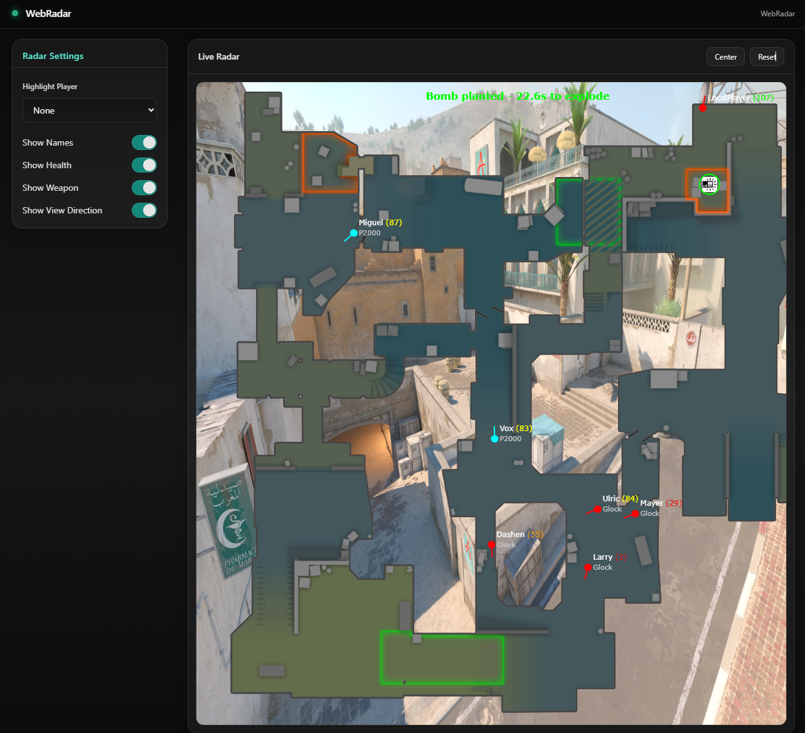

# Web Radar - Real-Time Spectator System for LAN Events

Web Radar is a real-time spectator system for CS2 LAN events, similar to 
professional broadcast tools used in esports production (such as HLTV's 
observer systems and tournament HUDs used in official Valve events). 

This project explores the technical challenges of building such systems:
low-latency data extraction, real-time streaming, and interactive visualization.

Local C++ telemetry client -> Node.js broker on LAN -> WebSocket -> React browser clients. Designed for secure, offline LAN event game viewing.


<div align="center">
  
  <p><i>Live tactical radar showing player positions, health, and equipment</i></p>
</div>

## Overview

Web Radar consists of three main components:
- **C++ Client** - Reads CS2 game memory to extract player positions, health, and game state
- **Node.js Server** - Receives data from the client and broadcasts it to connected browsers
- **React Frontend** - Interactive web-based radar with live updates and map overlays

## Features

- **Real-time Updates** - Real-time updates from game to browser
- **Interactive Radar** - Live player positions, health, and equipment display
- **Multiple Maps** - Support for 16+ CS2 maps with custom overlays
- **Bomb Tracking** - Real-time C4 location, plant timer, and defuse status
- **Customizable Display** - Toggle player names, health, weapons, and direction indicators
- **Player Highlighting** - Click to highlight and track specific players
- **Multi-Client Support** - Multiple browsers can connect simultaneously

## System Flow

```
┌─────────────────┐
│   CS2.exe       │ (Game running)
│   Game Memory   │
└────────┬────────┘
         │ ReadProcessMemory 
         ▼
┌─────────────────┐
│  C++ Client     │
│  (radar_client) │
│                 │
│  - dataRead()   │ ← Collects entity data
│  - radar()      │ ← Builds JSON 
└────────┬────────┘
         │ HTTP POST 
         │ localhost:22006/update
         │ Auth: Basic user:pass
         ▼
┌─────────────────────────┐
│  Node.js Server         │
│  (server.js)            │
│  Port 22006             │
│                         │
│  POST /update           │ ← Receives JSON
│  WebSocket Server       │ ← Broadcasts data
│  Static File Server     │ ← Serves React app
└────────┬────────────────┘
         │ WebSocket broadcast
         │ ws://localhost:22006/cs2_webradar
         ▼
┌─────────────────────────┐
│  React Frontend         │
│  (Browser)              │
│                         │
│  - WebSocket listener   │ ← Receives updates
│  - Canvas renderer      │ ← Draws at 60fps
│  - Map loader           │ ← Loads map images
└─────────────────────────┘
         │
         ▼
    User sees live radar
```


### Using the Interface

- **Toggle Display Options** - Use sidebar controls to show/hide:
  - Player names
  - Health indicators
  - Weapon information
  - Direction arrows

- **Highlight Players** - Click player names in sidebar to highlight on radar

- **Map Auto-Switch** - Map changes automatically when you load a new map in-game

## Technical Details

### Data Flow

1. **C++ Client** reads CS2 memory 
2. **JSON data** is built and sent via HTTP POST 
3. **Node.js server** receives POST requests and broadcasts via WebSocket
4. **React frontend** receives WebSocket updates and renders

### Authentication

All endpoints are protected with HTTP Basic Authentication:
- Username
- Password

### Maps

Each map includes:
- Background image
- Radar overlay
- Coordinate transformation data (data.json)

## API Reference

### POST /update

Receives game state data from C++ client.

**Request Body:**
```json
{
  "m_map": "de_dust2",
  "m_players": [
    {
      "m_name": "PlayerName",
      "m_position": {"x": 1234.5, "y": 678.9, "z": 100.0},
      "m_health": 100,
      "m_team": 2,
      "m_weapon": "ak47",
      "m_eye_angle": {"y": 45.0}
    }
  ],
  "m_bombs": [
    {
      "m_position": {"x": 500, "y": 300, "z": 0},
      "m_time": 35.2,
      "m_defusing": false,
      "m_defuse_time": 0
    }
  ]
}
```

## Development

### Technologies Used

**C++ Client:**
- Windows API (ReadProcessMemory, WinSock2)
- nlohmann/json

**Node.js Server:**
- Express.js
- WebSocket (ws)
- express-basic-auth
- pkg (executable packaging)

**React Frontend:**
- React 19
- Vite
- Tailwind CSS
- Canvas 2D API

## License

This project is for educational purposes only.
